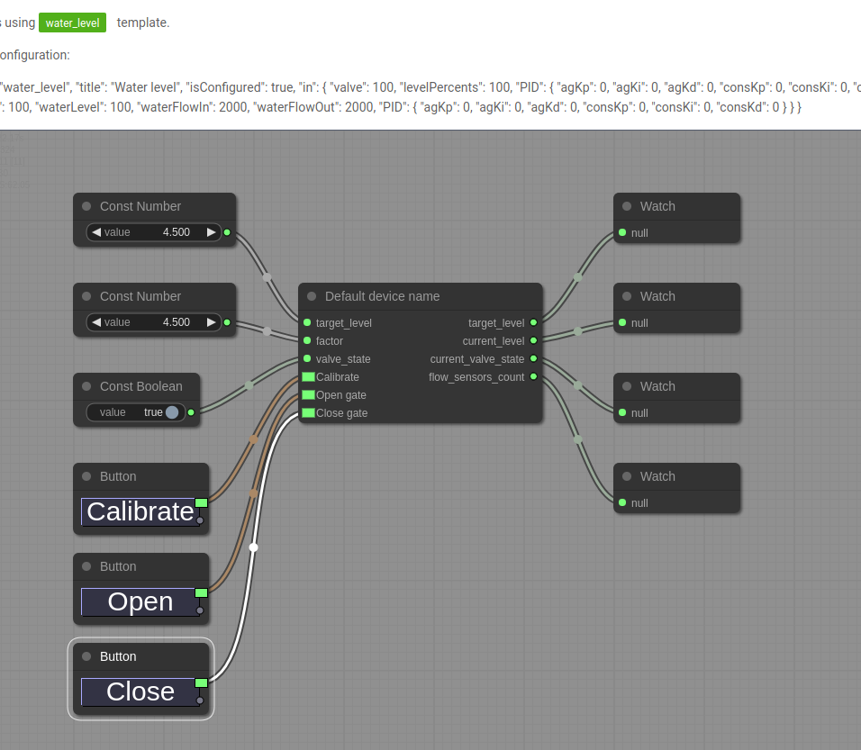

<p align="center">
  <a>
    
  </a>
</p>
<div align="center">
  <h1>Agrobot webclient</h1>
  <p>Argobot is a control and data processing system for irritation and hydroponic systems</p>
</div>

## ✨ Features / Tech stack

- 💡 Automate your hydroponics using graphs & tiny hardware parts
- ⛓️ litegraph.js for graphs manipulation & controllers configuration
- 📈 @antv/g2 for charts
- 📊 @antv/dataset for data analysis
- 🔴 Angular 9
- 🔌 ngx-mqtt for MQTT over Websockets
- 📦 Ngxs store

## 📦 Install

```bash
npm i
```

## 🔨 Build

```bash
ng build
# The build artifacts will be stored in the `dist/` directory. Use the `--prod` flag for a production build.

```

## ⌨️ Development

```bash
# edit env files in ./src/environments/ folder
ng serve

# Navigate to `http://localhost:4200/`. The app will automatically reload if you change any of the source files.

```

## 🤝 Contact

Email us at [brainhublab@gmail.com](mailto:brainhublab@gmail.com)

